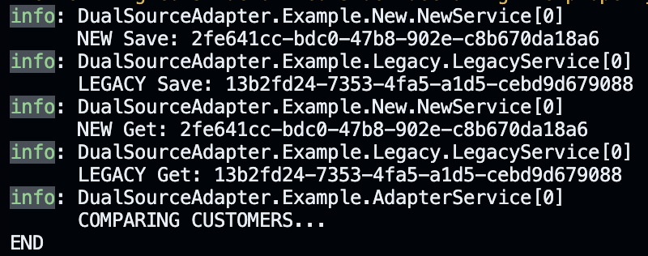

# DualSourceAdapter 
[](https://www.nuget.org/packages/DualSourceAdapter)

Migration Adapter for a dual source API



## Configuration

Here an example configuration with 3 implementations of `ICustomerRepository`,
a `NewService`, a `LegacyService` and an `AdapterService`, the usage of the library is internal to the latter and will be shown later.

`MigrationOption` is a configuration provided to configure the enabled `MigrationSource []` and the `Active` (master) configuration, from which data is stored and read first.

```csharp
var host = Host.CreateDefaultBuilder(args)
    .ConfigureServices(services => { 
        services.AddSingleton<LegacyService>();
        services.AddSingleton<NewService>();
        services.AddSingleton<ICustomerRepository, AdapterService>();

        var migrationOption = new MigrationOption {
            Active = MigrationSource.New,
            IsCompare = true,
            Sources = new [] {
                MigrationSource.New,
                MigrationSource.Legacy
            }
        };

        services.AddSingleton(migrationOption);
    })
    .Build();

```

## Creating an AdapterService

The creation of the adapter service goes as follows,
in this example only 2 flows need to be adapted differently, `read` and `write`,
but eventually more could be given (e.g. `read`, `write`, `auth`)

```csharp
this.readMigrator = new MigrationTaskBuilder<GetCustomerById, Customer?>(
            legacyService.GetCustomerByIdAsync,
            newService.GetCustomerByIdAsync,
            ReadCompare, // to compare data
            ReadResponseAdapter, // usually the identifier need to be adapter to match the old data
            ReadRequestAdapter // usually also new requests need to use a Map to retrieve the corresponding identifier for new data, based on old identifier
        );
```

conversely the write migrator is configured in a similar fashion

```csharp
this.writeMigrator = new MigrationTaskBuilder<CreateCustomerRequest, Customer>(
            legacyService.SaveCutomerAsync,
            newService.SaveCutomerAsync,
            StoreCustomerReference,
            WriteResponseAdapter,
            WriteRequestAdapter
        );
```

### Adapter Examples (may change)

```csharp
    public Task ReadCompare(PrimaryResponse<Customer?> customer, SecondaryResponse<Customer?> customerNew)
    {
        logger.LogInformation("COMPARING CUSTOMERS...");
        return Task.CompletedTask;
    }

    public async Task StoreCustomerReference(PrimaryResponse<Customer> primary, SecondaryResponse<Customer> secondary)
    {
        await Task.Delay(TimeSpan.FromMilliseconds(400));

        var p = GetPrimary(primary);
        var s = GetSecondary(secondary);
    
        CustomerRefStorage.Add(p.Id, s.Id);
    }

    public PrimaryResponse<Customer?> ReadResponseAdapter(PrimaryResponse<Customer?> primary, SecondaryResponse<Customer?> secondary)
    {
        var p = GetPrimary(primary);
        var s = GetSecondary(secondary);

        if(s is not null && p is not null)
        {
            p.Id = s.Id;
            return Primary<Customer?>(p);
        }

        return primary;
    }

    public PrimaryResponse<Customer> WriteResponseAdapter(PrimaryResponse<Customer> primary, SecondaryResponse<Customer> secondary)
    {
        // keep the reference consistent for clients
        secondary.Item.Id = primary.Item.Id;
        return Primary(secondary.Item);
    }

    public GetCustomerById ReadRequestAdapter(GetCustomerById request, PrimaryResponse<Customer?> primary) 
    {
        Customer? p = primary.Item;
        
        if(p is not null)
        {
            // grab the reference for the identifier in the new storage, based on old
            request.Id = CustomerRefStorage[p.Id];
        }

        return request;
    }

    public CreateCustomerRequest WriteRequestAdapter(CreateCustomerRequest request, PrimaryResponse<Customer> _) 
    {
        return request; // NOP
    }
```
